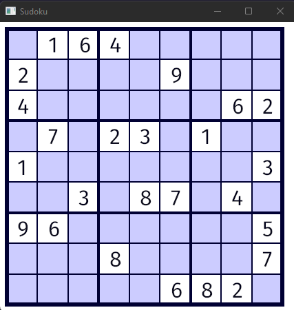

# Sudoku

A simple Sudoku game made with [rust](https://www.rust-lang.org/) and [piston](https://github.com/PistonDevelopers/piston).

## Example

## Features

- [x] 9x9 Sudoku Board
- [x] Random Puzzle Generation
- [ ] Saving current game progress

## Running Yourself

To run the game you need to have a rust development environment install on your computer. 

Steps:

1. `git clone https://github.com/ThatGuyJamal/Learning-Code`
2. `cd rust\learn\sudoku`
3. `cargo run`

## Docs

Click [here](https://thatguyjamal.github.io/sudoku-rs/).

## Todo

While the game is playable in theory, it can have some improvements. 

- save games in progress
- restart a puzzle
- get a hint
- load a different puzzle